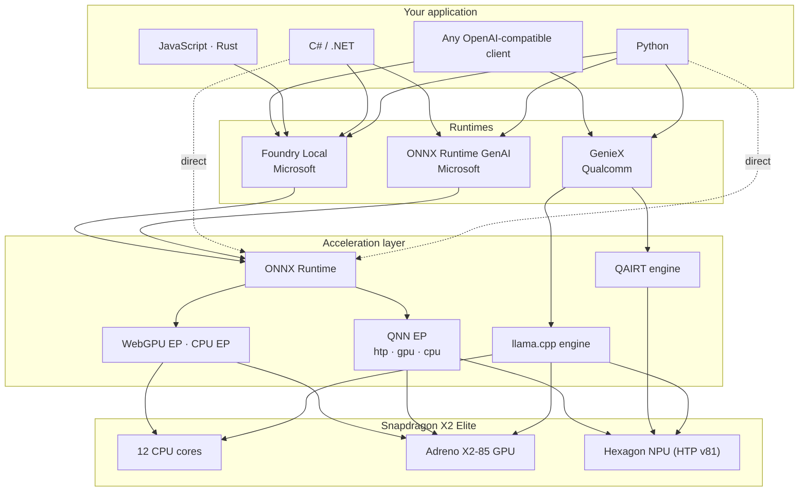
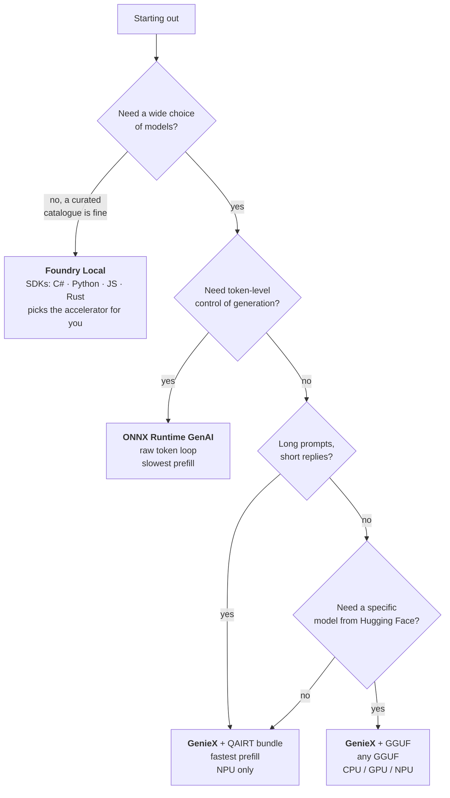
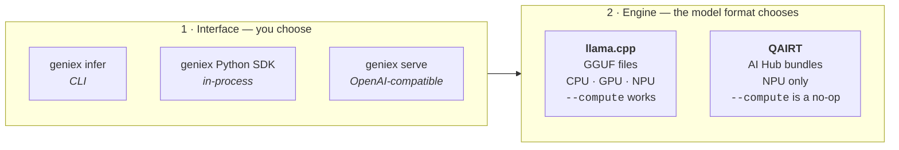

# Running an LLM locally on a Snapdragon X2 Elite

A practical guide to getting a language model running on the **Hexagon NPU** of
a Snapdragon X2 Elite laptop — and to knowing, with evidence, that it really is
running there.

There are three realistic runtimes on this hardware today. This guide covers
all three, explains what each is good at, and walks through a first token on
each one. Everything here was measured on one machine: a Microsoft Surface
Laptop with a Snapdragon X2 Elite (X2E78100), 64 GB RAM, Windows 11 ARM64.

| | |
| --- | --- |
| **Measured numbers** | [docs/BENCHMARKS.md](docs/BENCHMARKS.md) |
| **Resolved bugs and superseded findings** | [docs/ARCHIVE.md](docs/ARCHIVE.md) |
| **Compiling your own models** | [docs/COMPILING.md](docs/COMPILING.md) |
| **Contributor rules** | [AGENTS.md](AGENTS.md) |

---

## Quick start

If you want a token out of the NPU in about ten minutes and will read the rest
later:

```powershell
.\Scripts\Install-Prerequisites.ps1 -Install   # ARM64 git, Python 3.14, uv, VS Code
# install the GenieX CLI (section 5.1) — it is not in winget
# open a NEW shell so PATH picks up both
.\Scripts\Initialize-Workspace.ps1             # .venv + dependencies
.\Scripts\Test-Environment.ps1                 # pass/fail across the stack
geniex pull unsloth/Qwen3-0.6B-GGUF:Q4_0 --model-hub hf
geniex infer unsloth/Qwen3-0.6B-GGUF:Q4_0 -p "Hello" --compute npu --think=false
```

Then run `.\Scripts\Test-ComputeUnits.ps1` to see CPU, GPU and NPU compared on
the same prompt.

---

## Contents

1. [Key concepts](#1-key-concepts)
2. [Know your machine](#2-know-your-machine)
3. [Choosing a method](#3-choosing-a-method)
4. [Shared setup](#4-shared-setup)
5. [GenieX](#5-geniex)
6. [ONNX Runtime GenAI](#6-onnx-runtime-genai)
7. [Foundry Local](#7-foundry-local)
8. [Proving which compute unit ran](#8-proving-which-compute-unit-ran)
9. [Comparing the methods](#9-comparing-the-methods)
10. [Benchmarks](#10-benchmarks)
11. [Keeping the workspace current](#11-keeping-the-workspace-current)
12. [Troubleshooting](#12-troubleshooting)
13. [Open questions](#13-open-questions)

---

## 1. Key concepts

If you have run models on a GPU before, most of this transfers. The parts that
do not are worth five minutes.

**NPU, Hexagon, HTP.** The Snapdragon's neural processor. Qualcomm calls the
hardware the *Hexagon NPU* and its tensor engine the *HTP* (Hexagon Tensor
Processor). It is a fixed-function matrix engine: very fast at large batched
matrix multiplies, much less flexible than a GPU. It cannot train models — see
[section 13](#13-open-questions). Windows exposes it as an **MCDM compute
accelerator**, which is why it shows up in Task Manager as *DirectX 12, FL 1.0:
Compute* rather than as something NPU-shaped.

**HTP version and SoC model.** Compiled NPU artifacts are generation-specific.
This machine is **HTP v81, SoC model 88**; the previous generation (X Elite) is
HTP v73. An asset compiled for one is not tuned for the other, so always check
which generation a published model targets.

**Quantization.** Weights are stored at reduced precision so they fit in memory
and run fast. You will meet two naming schemes:

- `Q4_0`, `Q4_K_M` — llama.cpp's GGUF scheme
- `w4a16`, `w8a8` — Qualcomm's scheme, read as *weights 4-bit, activations
  16-bit*

Four-bit weights are roughly `parameters × 0.5 bytes`, before overhead.

**Prefill vs decode.** Two different phases of one request, with very different
performance characteristics:

- **Prefill** — reading your prompt. All tokens are processed *in parallel*, so
  it is a big batched matrix operation. **The NPU is far better at this** —
  5.8× to 8.7× the CPU's rate on this machine.
- **Decode** — writing the reply, one token at a time. Sequential and
  memory-bound. **The CPU is competitive here**, sometimes faster.

This matters more than any other single fact in this guide. A benchmark that
sends a short prompt and generates a long reply measures almost only decode,
and will tell you the NPU is barely worth using. A retrieval-augmented
application sending a 2,000-token prompt and getting back a short structured
reply is prefill-dominated, and the NPU wins decisively. **Measure the ratio
your application actually produces.**

**Execution provider (EP).** ONNX Runtime's plug-in backend system. The QNN
execution provider is what routes work to the Hexagon NPU. The critical detail:
QNN is a *plugin* EP and must be attached with the policy API — see
[section 6.2](#62-attaching-the-qnn-provider).

**The three model formats.** Knowing which you have determines which runtime
can load it:

| Format | Looks like | Runs on |
| --- | --- | --- |
| **GGUF** | one `.gguf` file | GenieX (llama.cpp engine) — CPU, GPU or NPU |
| **QAIRT bundle** | `genie_config.json` + `part1_of_4.bin` … | GenieX (QAIRT engine) — NPU only |
| **ONNX + GenAI config** | `.onnx` graph + `genai_config.json` | ONNX Runtime GenAI, Foundry Local |

> **`genie_config.json` and `genai_config.json` differ by one letter and are
> entirely different formats.** The first is Qualcomm Genie, the second is
> Microsoft ONNX Runtime GenAI. This is the single most confusing thing in the
> stack; [`model_format.py`](src/setup/model_format.py) exists to classify a
> directory before anything tries to load it.

---

## 2. Know your machine

Four facts decide everything downstream: the exact **SoC SKU**, the **NPU and
GPU driver versions**, the **AI Hub device name** matching your chip, and
whether your shell is **really ARM64**.

### 2.1 Run the inventory

```powershell
.\Scripts\Get-SystemInfo.ps1
```

Read-only. Add `-OutFile inventory.md` to save a copy. It warns if the NPU
driver is missing or the shell is not ARM64.

Run it in **native ARM64 PowerShell 7 (`pwsh`)**. On this machine `pwsh` is
Arm64 while `powershell.exe` (Windows PowerShell 5.1) is X64, and an emulated
interpreter cannot reach the NPU at all:

```powershell
[System.Runtime.InteropServices.RuntimeInformation]::ProcessArchitecture
```

The step most guides omit, and the one that yields your exact SoC SKU:

```powershell
Get-PnpDevice -Class 'Display','ComputeAccelerator' -Status OK |
  Select-Object Class, FriendlyName

Get-CimInstance Win32_PnPSignedDriver |
  Where-Object { $_.DeviceName -match 'Adreno|Hexagon|NPU|Neural' } |
  Select-Object DeviceName, DriverVersion, DriverDate
```

**The NPU appears under class `ComputeAccelerator`, not `Display`.** If nothing
returns there, the NPU driver is missing or the device is disabled, and no
runtime will reach the Hexagon HTP until that is fixed.

### 2.2 Match your chip to a runtime target

```powershell
geniex config get chipset          # GenieX auto-detects; no configuration needed
qai-hub-models devices             # find the row whose Chipset matches your SoC
```

Take the **Name** column from `qai-hub-models devices` — that exact string is
what you pass to `--device` when compiling. Note its **HTP Version**; assets are
compiled against it.

Keep firmware current. Install Windows updates plus your device model's
firmware package, reboot, then re-run the inventory and record the new driver
versions. **Driver updates change inference behaviour**, and not only on the
NPU — see [section 12](#12-troubleshooting).

### 2.3 Reference values for this machine

| Component | Measured value |
| --- | --- |
| Device | Microsoft Surface Laptop 13.8in 8th Ed Snapdragon |
| SoC | **Snapdragon X2 Elite**, SKU **X2E78100** @ 4.03 GHz, 12 cores / 12 logical |
| NPU | Qualcomm Hexagon NPU — driver **30.0.228.10000** |
| GPU | Qualcomm **Adreno X2-85** — driver **32.0.172.2** |
| Memory | **63.5 GiB (64 GB)** LPDDR5x, shared with the NPU and GPU |
| OS | Windows 11 Pro 10.0.28120, ARM64 |
| AI Hub device target | `Snapdragon X2 Elite CRD` — **HTP version 81**, SoC model 88 |
| Python | 3.14.7, ARM64 |
| GenieX CLI | **v0.8.0** — QAIRT 2.45, llama.cpp `9425611` |
| onnxruntime / -genai / -qnn | 1.30.0 / 0.17.1 / 2.6.0 |
| Foundry Local | 0.10.3 |

> **NPU TOPS figures are marketing throughput**, not a measure of how large or
> how fast a language model will run. Ignore them.

---

## 3. Choosing a method

### 3.1 The three runtimes



**Two of the three share a foundation.** ONNX Runtime GenAI and Foundry Local
both execute through **ONNX Runtime**, reaching the NPU via the QNN execution
provider; Foundry Local wraps that and chooses the provider for you, while ORT
GenAI leaves the choice — and the token loop — to you. GenieX is the outlier:
its own llama.cpp and QAIRT engines bypass ONNX Runtime entirely, which is why
it is the only route here that accepts GGUF files and the only one that reaches
the NPU without ONNX in the picture.

**You can also call ONNX Runtime directly**, from Python or C#, skipping all
three — the dotted lines in the diagram. That is the right level for models
that are not language models: embeddings, speech-to-text, OCR, translation.
For an LLM it means writing the KV-cache and sampling logic yourself, which is
precisely what ONNX Runtime GenAI exists to provide. See
[section 6.6](#66-calling-onnx-runtime-directly).

### 3.2 Which one should I use?



**If you are unsure, start with GenieX.** It has the widest model support, the
fastest path to a working token, and an OpenAI-compatible server if you later
want to call it from somewhere else. Foundry Local is the least work if its
catalogue happens to contain what you need — but on this machine only two of
its models target the NPU.

### 3.3 Capability matrix

| | GenieX | ONNX Runtime GenAI | Foundry Local |
| --- | --- | --- | --- |
| Vendor | Qualcomm | Microsoft | Microsoft |
| Model sourcing | Any GGUF on Hugging Face, plus AI Hub bundles | Hand-assembled; needs `genai_config.json` | Curated catalogue (~50 models) |
| Compute units | CPU, GPU, NPU (llama.cpp) · NPU (QAIRT) | NPU, GPU or CPU — QNN EP `backend_type` | NPU, GPU or CPU — one model variant each |
| Choose compute explicitly | `--compute` (llama.cpp only) | Policy API | No |
| OpenAI-compatible server | `geniex serve` | — | Optional, in-process |
| First-party SDKs | — (CLI and HTTP) | Python, C# (both verified on the NPU) | **C#, Python, JS, Rust** |
| Runs in your process | No | **Yes** | **Yes** (SDK) |
| Token-level control | No | **Yes** | No — chat API only |
| Tool calling | Model-dependent | Model-dependent | Catalogue flag; **1 NPU model** |
| Prefill speed (Qwen3-4B) | **2072 tok/s** (QAIRT) · 1380 (llama.cpp) | 437 tok/s | not measured on this axis |
| In-process decode (qwen2.5-0.5b) | — | — | **109 tok/s** via SDK, 28 over HTTP |
| Licence | Proprietary | MIT | Proprietary |

### 3.4 What each requires installed

All three need the [shared setup](#4-shared-setup) first — ARM64 Python, `uv`,
and the repo scripts.

| Method | Additionally needs | Install |
| --- | --- | --- |
| GenieX | GenieX CLI | Manual installer, [5.1](#51-install) |
| ONNX Runtime GenAI | `onnxruntime-genai`, `onnxruntime-qnn` | `uv sync` (already in `pyproject.toml`) |
| Foundry Local | Foundry Local | `winget install Microsoft.FoundryLocal` |

Two tools are needed by the repo scripts and are easy to miss: **`gh`** (GitHub
CLI, authenticated) for fetching GenieX releases and the `geniex-bench`
harness, and **`winget`** for the prerequisites installer.

### 3.5 Trade-offs

**GenieX is the fastest and the most flexible about models**, and it is the
only runtime here that can target CPU, GPU and NPU from one interface. Its
QAIRT engine is the fastest path on this hardware by a wide margin. The costs
are that it is proprietary, process-isolated (you talk to it over a CLI or
HTTP), and its QAIRT engine only accepts precompiled AI Hub bundles.

**ONNX Runtime GenAI gives you the token loop.** If you need to interleave
retrieval, inspect logits, or implement custom stopping, it is the only option
here that hands you generation one token at a time. It is also MIT-licensed.
The cost is speed — on this hardware its prefill is 3.5× slower than GenieX's
llama.cpp NPU path, because the available Phi-4 bundle runs its attention
layers on CPU. Model supply is the other constraint: you need a bundle that
ships `genai_config.json`, and there are not many.

**Foundry Local is the least work.** It ships as an in-process native library
with first-party SDKs for **C#, Python, JavaScript and Rust**, detects the
hardware and picks an execution provider itself, and manages the model cache.
Its OpenAI-compatible REST endpoint is optional — the SDK calls the core
library directly, with no HTTP hop. The costs are a small curated catalogue
and, on this machine, a severely limited NPU selection: only two of its models
target the NPU at all, and only one of those supports tool calling.

---

## 4. Shared setup

Needed by all three methods. Do this once.

### 4.1 Native ARM64 toolchain

```powershell
.\Scripts\Install-Prerequisites.ps1          # reports only
.\Scripts\Install-Prerequisites.ps1 -Install # installs via winget, pinned to arm64
```

Add `-IncludeDotnet` if you want the .NET SDK.

**Prefer native ARM64 builds throughout.** An x64 binary under emulation does
not demonstrate native performance, and an emulated Python cannot reach the
Hexagon NPU at all.

| Tool | Notes |
| --- | --- |
| Git | [Git for Windows](https://git-scm.com/downloads/win), ARM64 build |
| Editor | [VS Code ARM64](https://code.visualstudio.com/download) |
| Shell | Native ARM64 PowerShell 7+ (`pwsh`). **Not `powershell.exe`** |
| Python | 3.14 ARM64 (pinned by `.python-version`) |
| uv | Manages the venv and one-off tool execution |
| GitHub CLI (`gh`) | Needed by the update and prefill-benchmark scripts |

Confirm the interpreter is genuinely ARM64 — if it prints `AMD64` you are in an
emulated interpreter:

```powershell
python -c "import sys, platform, struct; print(sys.executable, platform.machine(), struct.calcsize('P') * 8)"
```

### 4.2 Python workspace

```powershell
.\Scripts\Initialize-Workspace.ps1
```

Creates `.venv` on the pinned Python version, runs `uv sync`, and verifies the
interpreter is ARM64. `-Recreate` rebuilds it; `-CacheRoot D:\atlas` places
model caches off the system drive. Manual equivalent:

```powershell
uv venv --python 3.14
.\.venv\Scripts\Activate.ps1
uv sync
```

### 4.3 Where models and data live

Model weights never belong in Git. The root `.gitignore` already excludes
`.venv/`, `models/`, `.atlas-local/`, `*.gguf` and `*.onnx`.

**Set cache paths before your first download**, or you will fill `C:` and copy
gigabytes later:

```powershell
$env:GENIEX_DATADIR = 'D:\atlas\geniex'             # honored by geniex
$env:HF_HOME        = 'D:\atlas\cache\huggingface'  # honored by huggingface_hub
```

| Location | Holds |
| --- | --- |
| `%USERPROFILE%\.cache\geniex\models` | GenieX pulled models (`geniex list`) |
| `models/` | Local assets, git-ignored |

Budget for source weights, converted copies, and caches. A 4B model is 2–3 GB
per copy.

### 4.4 Verify

```powershell
.\Scripts\Test-Environment.ps1          # 11 checks; -SkipNetwork drops the 2 AI Hub ones
```

Install-level only: it proves each layer loads and talks to the next. It does
**not** prove a model runs on the NPU — [section 8](#8-proving-which-compute-unit-ran)
does that.

### 4.5 Script index

| Step | Script | Safe to run |
| --- | --- | --- |
| [§2.1 Run the inventory](#21-run-the-inventory) | [`Get-SystemInfo.ps1`](Scripts/Get-SystemInfo.ps1) | Yes, read-only |
| [§4.1 Native ARM64 toolchain](#41-native-arm64-toolchain) | [`Install-Prerequisites.ps1`](Scripts/Install-Prerequisites.ps1) | Reports only; `-Install` to act |
| [§4.2 Python workspace](#42-python-workspace) | [`Initialize-Workspace.ps1`](Scripts/Initialize-Workspace.ps1) | Yes |
| [§4.4 Verify](#44-verify) | [`Test-Environment.ps1`](Scripts/Test-Environment.ps1) | Yes, read-only |
| [§6 ONNX Runtime GenAI](#6-onnx-runtime-genai) | [`check_qnn.py`](src/setup/check_qnn.py) · [`model_format.py`](src/setup/model_format.py) | Yes, read-only |
| [§6.3 Hello world — Python](#63-hello-world--python) | [`run_ort_genai.py`](src/setup/run_ort_genai.py) | Yes; runs inference |
| [§7.5 Tool calling](#75-tool-calling) | [`Test-ToolCalling.ps1`](Scripts/Test-ToolCalling.ps1) | Yes; runs inference |
| [§8 Proving which compute unit ran](#8-proving-which-compute-unit-ran) | [`Test-ComputeUnits.ps1`](Scripts/Test-ComputeUnits.ps1) · [`Get-AcceleratorLuid.ps1`](Scripts/Get-AcceleratorLuid.ps1) | Yes; runs inference |
| [§10 Benchmarks](#10-benchmarks) | [`Invoke-Benchmark.ps1`](Scripts/Invoke-Benchmark.ps1) · [`Invoke-PrefillBench.ps1`](Scripts/Invoke-PrefillBench.ps1) · [`Invoke-FoundryBench.ps1`](Scripts/Invoke-FoundryBench.ps1) · [`bench_ort_genai.py`](src/setup/bench_ort_genai.py) | Yes; runs inference |
| [§11 Keeping the workspace current](#11-keeping-the-workspace-current) | [`Update-Workspace.ps1`](Scripts/Update-Workspace.ps1) | Reports only; `-Apply` to act |
| Published model performance | [`model_catalog.py`](src/setup/model_catalog.py) | Yes, read-only; no token |
| [§6.4 Hello world — C#](#64-hello-world--c) | [`src/csharp/GenAiProbe`](src/csharp/GenAiProbe) | Yes; runs inference |
| [§9 Comparing the methods](#9-comparing-the-methods) | [`src/csharp/AtlasChat`](src/csharp/AtlasChat) · [all C# projects](src/csharp) | Yes; interactive chat across runtimes |
| [§7.3 Hello world — in-process SDK](#73-hello-world--in-process-sdk) | [`bench_foundry_sdk.py`](src/setup/bench_foundry_sdk.py) · [`src/csharp/FoundryProbe`](src/csharp/FoundryProbe) | Yes; runs inference |
| [§6.6 Calling ONNX Runtime directly](#66-calling-onnx-runtime-directly) | [`src/csharp/QnnProbe`](src/csharp/QnnProbe) | Yes; proves C# NPU placement |
| [Compiling your own models](docs/COMPILING.md) | [`hub_profile.py`](src/setup/hub_profile.py) | Uploads model; needs API token |

---

## 5. GenieX

Qualcomm's on-device inference runtime, and the best starting point on this
hardware.

### 5.1 Install

GenieX is **not in winget**. The [install page](https://geniex.aihub.qualcomm.com/en/run/cli/install)
offers a browser download, but the GitHub release is scriptable and ships a
checksum, which is preferable:

```powershell
$dir = Join-Path $env:TEMP 'geniex-setup'
New-Item -ItemType Directory -Force -Path $dir | Out-Null
gh release download v0.8.0 --repo qualcomm/GenieX `
  --pattern 'geniex-cli-setup-windows-arm64-v0.8.0.exe*' --dir $dir

$exe = Join-Path $dir 'geniex-cli-setup-windows-arm64-v0.8.0.exe'
$expected = ((Get-Content "$exe.sha256" -Raw) -split '\s+')[0].Trim().ToLower()
if ((Get-FileHash $exe -Algorithm SHA256).Hash.ToLower() -ne $expected) { throw 'checksum mismatch' }

Start-Process $exe -ArgumentList '/VERYSILENT','/SUPPRESSMSGBOXES','/NORESTART' -Wait
```

The installer is **not code-signed** — run it interactively and SmartScreen
will warn. Verifying the published SHA256, as above, is the better safeguard.
It installs per-user to `%LOCALAPPDATA%\GenieX CLI\geniex.exe`, so no elevation
is needed.

[`Update-Workspace.ps1 -Apply`](#11-keeping-the-workspace-current) automates
this for upgrades, including the checksum check.

Verify — chipset detection is automatic:

```powershell
geniex version
geniex config get chipset        # expect: Snapdragon X2 Elite CRD
```

### 5.2 Two axes: interface and engine

GenieX has **two independent choices**, and conflating them causes confusion.
You pick the interface. The **engine is picked for you, by the format of the
model you hand it**.



| | llama.cpp engine | QAIRT engine |
| --- | --- | --- |
| Accepts | GGUF | Precompiled AI Hub bundles |
| Compute units | CPU, GPU, NPU | NPU only |
| `--compute` | Works — 28 % spread measured | **No effect** — 1.4 % spread |
| Model supply | Any GGUF on Hugging Face | Qualcomm's catalogue |
| Speed (Qwen3-4B prefill) | 1380 tok/s | **2072 tok/s** |

To confirm which engine a cached model will use, read `PluginId` in its
`geniex.json` — `llama_cpp` or `qairt`.

> **There is no `--runtime` flag.** The engine is selected by model format.
> `geniex_llamacpp` and `geniex_qairt` are real identifiers, but they belong to
> `qai-hub-models fetch --runtime`, a different tool.

### 5.3 Hello world — CLI

GenieX requires a model to be **cached before inference**: `pull`, then `infer`.

```powershell
# Smallest — proves the path works, 364 MB
geniex pull unsloth/Qwen3-0.6B-GGUF:Q4_0 --model-hub hf
geniex infer unsloth/Qwen3-0.6B-GGUF:Q4_0 -p "What is Rayleigh scattering?" --compute npu --think=false
```

```powershell
# The benchmarked models, if you want numbers comparable to docs/BENCHMARKS.md
geniex pull unsloth/Qwen3-4B-GGUF:Q4_0 --model-hub hf    # 2.2 GB, llama.cpp engine
geniex pull ai-hub-models/Qwen3-4B                       # 3.0 GB, QAIRT engine
geniex infer qualcomm/Qwen3-4B:W4A16 -p "Plan a day in Lisbon."
```

`--think=false` matters for Qwen3-style models, which otherwise emit a long
`<think>` block before answering.

**No separate Hugging Face utility is needed.** `geniex pull --model-hub hf`
resolves the repo, picks the quantization from the `:TAG` suffix, and caches it.
Supported hubs: `aihub`, `hf`, `modelscope`, `docker`, `localfs`.

To see available quantizations before pulling:

```powershell
(Invoke-RestMethod 'https://huggingface.co/api/models/unsloth/Qwen3-4B-GGUF').siblings.rfilename |
  Where-Object { $_ -match '\.gguf$' }
```

A GGUF already on disk:

```powershell
geniex pull my-local-model --model-hub localfs --local-path D:\models\phi-4-instruct.gguf
geniex infer my-local-model
```

Cache management: `geniex list`, `geniex remove <model> -y`, `geniex clean`.

> **Two `pull` behaviours worth knowing.** It **hangs when its output is
> redirected** — run it in a real terminal, not a background job. And it can
> **report success without downloading anything** if the name resolves to an
> already-cached bundle. The tell is a missing `Location:` line in the output.

### 5.4 Hello world — Python SDK

**Untested here.** It resolves for ARM64 Python 3.14 but is not installed in
this repo's environment, so treat the snippet as from the vendor's docs rather
than as verified.

```powershell
uv add geniex
```

```python
from geniex import AutoModelForCausalLM

model = AutoModelForCausalLM.from_pretrained("unsloth/Qwen3-0.6B-GGUF", precision="Q4_0")

messages = [{"role": "user", "content": "What is Rayleigh scattering?"}]
prompt = model.tokenizer.apply_chat_template(messages, add_generation_prompt=True)

for chunk in model.generate(prompt, max_new_tokens=256, stream=True):
    print(chunk, end="", flush=True)

model.close()
```

### 5.5 Hello world — OpenAI-compatible server

For LangChain, AutoGen, CrewAI, or any OpenAI-shaped client.

`geniex serve` takes **no model argument** and **no `--port` flag** — pull the
model first, and set the address with `--host`:

```powershell
geniex pull unsloth/Qwen3-0.6B-GGUF:Q4_0 --model-hub hf
geniex serve                                              # 127.0.0.1:18181
geniex serve --host 127.0.0.1:8080 --compute npu --power-mode burst
```

```python
import requests

BASE = "http://127.0.0.1:18181/v1"

def generate(prompt: str, model: str = "unsloth/Qwen3-0.6B-GGUF:Q4_0") -> str:
    """Send one chat completion to the local GenieX server."""
    response = requests.post(
        f"{BASE}/chat/completions",
        json={
            "model": model,
            "messages": [{"role": "user", "content": prompt}],
            "temperature": 0.7,
        },
        timeout=120,
    )
    response.raise_for_status()
    return response.json()["choices"][0]["message"]["content"]


if __name__ == "__main__":
    print(generate("Explain quantum computing briefly."))
```

`geniex run <model>` is the CLI equivalent against an already-running server.

**Prefer the server for repeated use.** Model load and NPU initialisation are
paid once at startup rather than on every invocation — on the llama.cpp path
that is worth about 1.5 s per call.

### 5.6 Choosing a compute unit

```powershell
geniex infer <model> --compute npu     # also: cpu, gpu, hybrid, or HTP0,HTP1
```

| Flag | Values | Notes |
| --- | --- | --- |
| `-c, --compute` | `cpu`, `gpu`, `npu`, `hybrid`, `HTP0,...` | **Defaults to `npu`.** llama.cpp only |
| `--power-mode` | `low_power_saver` … `burst` | Defaults to `burst`. Pin this when benchmarking |
| `--nctx` | int | Context window, default 4096, llama.cpp only |
| `-n, --ngl` | int | Layers offloaded, `-1` = all, llama.cpp only |
| `--max-tokens` | int | Default 2048 |
| `--think` | bool | Default **true**; use `--think=false` for Qwen3 |
| `--spec-type` | `draft-mtp`, `ngram-cache`, … | Speculative decoding, llama.cpp only |

**`--compute` has no effect on a QAIRT bundle.** Those are NPU-targeted by
construction. A 1.4 % spread across `cpu`/`gpu`/`npu` on a QAIRT model is the
flag being ignored, not evidence of CPU execution.

### 5.7 Finding models

```powershell
geniex model list                    # the GenieX catalogue
qai-hub-models fetch qwen3_4b -i     # list a model's assets without downloading
```

Qualcomm publishes measured performance per model per device, so "how fast is
X on my chip" rarely needs benchmarking — see the
[model catalogue](docs/BENCHMARKS.md#model-catalogue).

### 5.8 Using llama.cpp without GenieX

GenieX bundles llama.cpp, but it is not the only way to reach it. Upstream
llama.cpp has **official Windows-on-Snapdragon support**, with three backends:

| Backend | Reaches | Practical cost |
| --- | --- | --- |
| CPU (ARM64) | CPU | None — a normal build |
| OpenCL | Adreno GPU | Needs the Qualcomm OpenCL SDK. **No test signing required** |
| Hexagon | Hexagon NPU | Needs the Hexagon SDK **and signed HTP ops libraries** |

```powershell
python scripts\snapdragon\setup-sdk.py --opencl     # or --hexagon
cmake --preset arm64-windows-snapdragon-release -B build-wos
```

**The Hexagon backend is the catch.** Its HTP ops libraries must be included in
a digitally signed `.cat` file, and the upstream documentation has you enable
test signing (`bcdedit /set TESTSIGNING ON`) to run an unsigned build. That is
a machine-wide security posture change, not a build flag.

**This is the clearest argument for GenieX.** It ships a prebuilt, signed
llama.cpp with working HTP support, so the NPU path costs an installer rather
than a code-signing certificate and a reboot into test signing. If you only
want the Adreno GPU, upstream llama.cpp with the OpenCL backend is a reasonable
alternative with no such constraint.

> **Ollama and LM Studio** are the usual follow-up question. Both build on
> llama.cpp and ship Windows ARM64 builds, but reports through 2025–2026
> consistently describe them as **CPU-only on Windows on Arm**, with NPU and
> GPU acceleration still outstanding
> ([ollama#5360](https://github.com/ollama/ollama/issues/5360)). Neither was
> tested here — check the current state before relying on either for
> accelerated inference.

---

## 6. ONNX Runtime GenAI

Use this when you need your own token loop, or when Python is a stepping stone
to a C# application — the .NET API mirrors it closely.

### 6.1 Install

Already in `pyproject.toml`; `uv sync` is enough.

```powershell
uv add "onnxruntime-genai>=0.17.0" onnxruntime-qnn
```

**The version floor matters.** `onnxruntime-genai` 0.16.x cannot run
EPContext/QNN models at all. The project pins `>=0.17.0` for that reason, and
[`repro_genai_016_qnn.py`](src/setup/repro_genai_016_qnn.py) is kept as a
regression guard — run it after any upgrade. Details in the
[archive](docs/ARCHIVE.md#onnxruntime-genai-0160-broke-epcontextqnn-models).

### 6.2 Attaching the QNN provider

This is the single most important detail in this section.

**`providers=["QNNExecutionProvider"]` does not attach the QNN provider.** It is
silently ignored, the session runs entirely on CPU, and nothing warns you. QNN
is a *plugin* EP registered through `register_execution_provider_library`, and
the legacy `providers` list does not resolve plugin EPs.

Attach it with the **policy API**:

```python
import onnxruntime as ort, onnxruntime_qnn as qnn_ep

ort.register_execution_provider_library("QNNExecutionProvider", qnn_ep.get_library_path())

so = ort.SessionOptions()
so.set_provider_selection_policy(ort.OrtExecutionProviderDevicePolicy.PREFER_NPU)
sess = ort.InferenceSession(model_path, sess_options=so)   # note: NO providers= argument
```

Measured on `squeezenet1_1` w8a8, same model and machine:

| Attachment | Nodes on QNN |
| --- | --- |
| `providers=["QNNExecutionProvider"]` | **0 / 49** — all CPU |
| `set_provider_selection_policy(PREFER_NPU)` | **1 / 1** — whole graph fused |

For `onnxruntime-genai`, the equivalent is to attach the provider to the config:

```python
import onnxruntime_genai as og, onnxruntime_qnn as qnn_ep

og.register_execution_provider_library("QNNExecutionProvider", qnn_ep.get_library_path())

# Registering the library is NOT enough -- attach the provider to the config,
# or GenAI builds a CPU-only session and the EPContext nodes have no EP to run on.
config = og.Config(MODEL_DIR)
config.clear_providers()
config.append_provider("QNNExecutionProvider")
model = og.Model(config)
```

Note that `QNNExecutionProvider` is **not** in `ort.get_available_providers()`
before the registration call.

**Always verify.** A successful `run()` is not evidence of placement — see
[section 8](#8-proving-which-compute-unit-ran).

**The QNN provider is not NPU-only.** It has three backends, selected with
`backend_type` (or a `backend_path` such as `QnnHtp.dll`):

| `backend_type` | Target | Notes |
| --- | --- | --- |
| `htp` | Hexagon NPU | The default. **Quantized models only** |
| `gpu` | Adreno GPU | Accepts float models, no quantization needed |
| `cpu` | CPU | Reference implementation, for testing |

Three constraints follow from choosing `htp`, and they explain most "why will
this model not run on the NPU" questions:

- **Quantized, in QDQ form.** Float32 must be converted to int8/uint8/int16/
  uint16 with Quantize–Dequantize nodes. Quantization itself runs on x64; only
  inference runs on ARM64.
- **Fixed input shapes.** Dynamic dimensions are not supported.
- **A subset of operators.** Anything unsupported either falls back to CPU or
  errors, depending on `session.disable_cpu_ep_fallback`.

Other provider options worth knowing: `htp_performance_mode` (`burst`,
`balanced`, `sustained_high_performance` …) — set this to `burst` when
benchmarking, to match what GenieX does by default — plus `profiling_level`
and `vtcm_mb`. Session-level `ep.context_enable` caches the compiled graph as
an EPContext binary, which is what the published NPU bundles contain; see
[docs/COMPILING.md](docs/COMPILING.md#compiling-an-epcontext-model-locally).

### 6.3 Hello world — Python

The only NPU-ready ORT GenAI model confirmed working here is Microsoft's Phi-4
bundle. There is no smaller option — this path has a narrow model supply.

```powershell
uv add huggingface-hub          # provides the `hf` CLI
hf download microsoft/Phi-4-mini-reasoning-onnx --include "npu/*" --local-dir models\Phi-4-mini-reasoning-onnx
```

```powershell
.\.venv\Scripts\python.exe src\setup\check_qnn.py --model-dir models\Phi-4-mini-reasoning-onnx\npu\qnn-int4
.\.venv\Scripts\python.exe src\setup\run_ort_genai.py --model-dir models\Phi-4-mini-reasoning-onnx\npu\qnn-int4
```

[`check_qnn.py`](src/setup/check_qnn.py) verifies the provider stack and
classifies the model directory *without loading it*, so a format mismatch is
explained rather than surfacing as an opaque parse error.

| Model | Size | Notes |
| --- | --- | --- |
| `microsoft/Phi-4-mini-reasoning-onnx` | 2.8 GB | `npu/qnn-int4/` — works |
| `microsoft/Phi-4-mini-instruct-onnx` | — | **No NPU assets**; `cpu_and_mobile/` and `gpu/` only |

Use `hf`, not `huggingface-cli` — the latter is superseded in
`huggingface_hub` 1.x.

**Models published for X Elite load fine on X2 Elite.** The Phi-4 bundle
declares `soc_model: 60` (X Elite) and all four context binaries load cleanly
here, with only a benign file-mapping warning. Do not rule out an asset on
`soc_model` alone.

### 6.4 Hello world — C#

The .NET API mirrors the Python one closely, and it reaches the NPU. Three
packages, which together match the verified Python stack:

```xml
<PackageReference Include="Microsoft.ML.OnnxRuntimeGenAI" Version="0.17.1" />
<PackageReference Include="Microsoft.ML.OnnxRuntime" Version="1.30.0" />
<PackageReference Include="Qualcomm.ML.OnnxRuntime.QNN" Version="2.6.0" />
```

> **Do not reach for `Microsoft.ML.OnnxRuntimeGenAI.QNN`.** It is pinned at
> **0.13.2**, far behind the 0.17.1 above. 0.13.2 is not in the broken 0.16.x
> range, so it may well work, but it was not tested here and it mixes the
> all-in-one packaging model with the plugin one. The combination above is what
> was measured.

```csharp
using Microsoft.ML.OnnxRuntimeGenAI;

// The QNN natives ship under runtimes/win-arm64/native, not beside the exe.
string nativeDir = Path.Combine(AppContext.BaseDirectory, "runtimes", "win-arm64", "native");
Environment.SetEnvironmentVariable(
    "PATH", nativeDir + ";" + Environment.GetEnvironmentVariable("PATH"));

// GenAI exposes no registration helper of its own; register through ORT, which
// is the same native runtime underneath.
OrtEnv.Instance().RegisterExecutionProviderLibrary(
    "QNNExecutionProvider", Path.Combine(nativeDir, "onnxruntime_providers_qnn.dll"));

// Registering is NOT enough -- attach the provider to the config, or GenAI
// builds a CPU-only session and the EPContext nodes have no EP to run on.
using var config = new Config(modelDir);
config.ClearProviders();
config.AppendProvider("QNNExecutionProvider");

using var model = new Model(config);
using var tokenizer = new Tokenizer(model);

using var genParams = new GeneratorParams(model);
using var generator = new Generator(model, genParams);
generator.AppendTokenSequences(tokenizer.Encode("<|user|>\nWhat is 17 times 23?<|end|>\n<|assistant|>"));

using var stream = tokenizer.CreateStream();
while (!generator.IsDone())
{
    generator.GenerateNextToken();
    Console.Write(stream.Decode(generator.GetSequence(0)[^1]));
}
```

**Measured** with [`src/csharp/GenAiProbe`](src/csharp/GenAiProbe) on
Phi-4-mini-reasoning, 64 tokens:

| Metric | Value |
| --- | --- |
| Model load | 7.4–8.1 s |
| Time to first token | 0.19–0.52 s |
| Decode | 17.7–22.0 tok/s |
| **NPU peak** | **98.9 %** |

```powershell
dotnet run -c Release --project src\csharp\GenAiProbe
```

Two details the run makes visible. The loader reports
*"Context binary … is 3.2.1. File mapping is only supported for versions >=
3.3.3"* for each of the four QNN binaries — benign. And it overwrites the
bundle's declared `soc_model` of **60** (X Elite) without complaint, which is
the same reason the Python path works on this machine despite the mismatch.

Skipping the registration step fails with *"QNN execution provider is not
supported in this build"* rather than quietly running on CPU, because this
bundle names QNN in its own `genai_config.json`.

### 6.5 Model formats

`onnxruntime-genai` requires a directory containing an ONNX graph **plus
`genai_config.json`**. A GenieX QAIRT bundle contains `genie_config.json` and
four QNN context binaries with no `.onnx` file anywhere — pointing `og.Model()`
at it cannot succeed.

| Looks like | Actually is | Config file |
| --- | --- | --- |
| `genie` / "GenAI Inference Extensions" | Qualcomm Genie bundle | `genie_config.json` |
| `onnxruntime-genai` | Microsoft ORT GenAI | `genai_config.json` |

AI Hub's ONNX assets target plain ONNX Runtime with the QNN EP and may not ship
`genai_config.json`. **The reliable source for ORT GenAI models is Microsoft's
own `*-onnx` Hugging Face repos.**

### 6.6 Calling ONNX Runtime directly

ONNX Runtime GenAI is a layer *on top of* ONNX Runtime that supplies the
generation loop — KV cache, sampling, chat templating. You can skip it and use
`Microsoft.ML.OnnxRuntime` (C#) or `onnxruntime` (Python) on their own.

**When that is the right choice:** any model that is not a language model.
Embeddings, Whisper, OCR and translation assets are plain ONNX graphs with one
forward pass and no token loop, so the GenAI layer adds nothing. All the task
models in [the catalogue](docs/BENCHMARKS.md#task-models) run this way.

**When it is not:** for an LLM you would be reimplementing the KV cache,
sampling and stopping logic yourself. Reach for ORT GenAI instead.

**The NuGet packages you choose decide which attachment API works**, and the
combination that works today is:

```xml
<PackageReference Include="Microsoft.ML.OnnxRuntime" Version="1.30.0" />
<PackageReference Include="Qualcomm.ML.OnnxRuntime.QNN" Version="2.6.0" />
```

That mirrors Python's `onnxruntime` + `onnxruntime-qnn`, and it means QNN
arrives as a **plugin** execution provider — exactly as it does in Python, with
the same consequence for how you attach it.

```csharp
using Microsoft.ML.OnnxRuntime;

// The QNN natives ship under runtimes/win-arm64/native, not beside the exe.
string nativeDir = Path.Combine(AppContext.BaseDirectory, "runtimes", "win-arm64", "native");
Environment.SetEnvironmentVariable(
    "PATH", nativeDir + ";" + Environment.GetEnvironmentVariable("PATH"));

// Register the plugin, then select it by POLICY. See the warning below.
OrtEnv.Instance().RegisterExecutionProviderLibrary(
    "QNNExecutionProvider", Path.Combine(nativeDir, "onnxruntime_providers_qnn.dll"));

var so = new SessionOptions();
so.SetEpSelectionPolicy(ExecutionProviderDevicePolicy.PREFER_NPU);

// Turn a silent CPU fallback into a hard error. A session config entry,
// not a property.
so.AddSessionConfigEntry("session.disable_cpu_ep_fallback", "1");

using var session = new InferenceSession(modelPath, so);
```

**Measured** with [`src/csharp/QnnProbe`](src/csharp/QnnProbe), which counts
node placement from the ORT profiler rather than trusting a successful `Run()`:

| Attachment | Result |
| --- | --- |
| none (baseline) | `CPUExecutionProvider=1` |
| `AppendExecutionProvider("QNN", opts)` | **throws** — *"QNN execution provider is not supported in this build"* |
| `SetEpSelectionPolicy(PREFER_NPU)` | **`QNNExecutionProvider=1`** |

```powershell
dotnet run -c Release --project src\csharp\QnnProbe
```

> **`AppendExecutionProvider("QNN", ...)` with a provider-options dictionary is
> the form you will find in most examples, and it does not work with these
> packages.** QNN is a plugin EP here, and only the policy API resolves it —
> the same trap as Python's `providers=[...]`, except C# at least throws
> instead of silently running on CPU. If you are following an example that uses
> the options dictionary, it assumes the older all-in-one
> `Microsoft.ML.OnnxRuntime.QNN` package (1.24.x), which compiles QNN into the
> build. Pick one model or the other; do not mix the advice.
>
> Two further corrections worth carrying over if you have seen them elsewhere:
> the fp16 option is **`enable_htp_fp16_precision`** (`"0"`/`"1"`), not
> `htp_precision`, which does not exist; and CPU fallback is disabled with the
> session config entry **`session.disable_cpu_ep_fallback`**, not a
> `DisableCpuMemCopy` property — that is unrelated to provider placement.

> **`OrtEnv.GetAvailableProviders()` will not show QNN**, before or after
> registration, even when the graph demonstrably runs on the NPU. Unlike
> Python, where the plugin does appear in the list, in C# it never does. Do not
> use it as an availability check — verify with node placement or by setting
> `session.disable_cpu_ep_fallback` and seeing whether the session still loads.

`QnnHtp.dll` and its matching stub must be resolvable at runtime. The
`Qualcomm.ML.OnnxRuntime.QNN` package ships both generations —
`QnnHtpV81Stub.dll` for this machine and `V73` for X Elite — so point the
loader at `runtimes/win-arm64/native` rather than copying one by hand.

---

## 7. Foundry Local

Microsoft's on-device runtime. It wraps ONNX Runtime, detects the hardware and
picks an execution provider itself, and manages the model cache.

**It is a library, not a daemon.** Your application loads the Foundry Local
Core API in-process and calls it through a first-party SDK:

| Language | Package | Version used here |
| --- | --- | --- |
| Python | `foundry-local-sdk` | 2.1.0 |
| C# | `Microsoft.AI.Foundry.Local` | 2.1.0 |
| JavaScript | `foundry-local-sdk` | — |
| Rust | `foundry-local-sdk` | — |

> **Use 2.x, and do not use the `-winml` packages.** SDK **2.0.1 was a
> breaking release**: the separate `-winml` variants were retired in favour of a
> single package that detects the hardware itself, and the in-process
> OpenAI-style clients were replaced by the **Session API**. For C#, that means
> dropping `.WinML` from the package name. The old variants are frozen at 1.2.4
> and still on NuGet and PyPI, so it is easy to install the wrong one — and
> parts of Microsoft's own quickstart still show the 1.x API.
>
> It matters beyond the API shape: `foundry-local-sdk-winml` 1.2.4 pulls
> `onnxruntime-genai-core` **0.14.1**, while 2.1.0 pulls **0.17.1**. On the
> older one, throughput here was erratic — 103 tok/s on the first run then
> 9–15 on every run after — and the process **segfaulted on exit**. On 2.1.0
> it is flat at ~107 tok/s with a clean exit.

On Windows the SDK obtains execution providers through **Windows ML**, which
sources the plugins from the OS and Windows Update and handles driver
compatibility — that is how the Qualcomm NPU provider is registered.

The OpenAI-compatible REST endpoint is **optional**: the SDK can start one
inside your process for tools that speak HTTP, such as LangChain or Open WebUI,
but native SDK calls skip it entirely.

Both routes are measured below. **They are not close**: the in-process SDK is
roughly **four times faster** than the HTTP endpoint on the same model.

> [github.com/microsoft-foundry](https://github.com/microsoft-foundry) is the
> **Azure** Foundry platform and is cloud-oriented. The on-device project is
> [github.com/microsoft/foundry-local](https://github.com/microsoft/foundry-local).

### 7.1 Install

```powershell
winget install --id Microsoft.FoundryLocal -e
foundry status                      # hardware + versions
```

The winget package is a native ARM64 build on Windows ML. It detects this
hardware correctly, reporting the Hexagon NPU by its full SKU.

There is no setup script for Foundry in this repo, and
`Test-Environment.ps1` does not check for it — it is installed and verified by
hand.

### 7.2 Hello world — CLI and HTTP

This is the path measured in this repo.

```powershell
foundry model list                  # catalogue, with the device chosen per model
foundry model download qwen2.5-0.5b # 442 MB, NPU, supports tools
foundry model load qwen2.5-0.5b
foundry server start                # OpenAI-compatible, dynamic port
```

```powershell
# Or, benchmarked: phi-3.5-mini, 2.0 GB
foundry model download phi-3.5-mini
```

Then over HTTP — note the endpoint port is dynamic, so read it from
`foundry status`:

```python
import requests

BASE = "http://127.0.0.1:52286/v1"      # read the port from `foundry status`

response = requests.post(
    f"{BASE}/chat/completions",
    json={
        "model": "qwen2.5-0.5b-instruct-qnn-npu",
        "messages": [{"role": "user", "content": "Plan a day in Lisbon."}],
        "max_tokens": 400,
    },
    timeout=120,
)
print(response.json()["choices"][0]["message"]["content"])
```

> **Two API traps, both returning a bare `400`.** The CLI takes an alias
> (`qwen2.5-0.5b`) but the OpenAI API wants the concrete **variant id**
> (`qwen2.5-0.5b-instruct-qnn-npu`); the alias appears only as that variant's
> `parent` in `/v1/models`. And being **downloaded is not being loaded** —
> `/v1/models` lists what is on disk, but a request against an unloaded model
> fails with *"Model … is not loaded"*. Run `foundry model load <alias>` first.
> [`Invoke-FoundryBench.ps1`](Scripts/Invoke-FoundryBench.ps1) handles both.

### 7.3 Hello world — in-process SDK

The SDK loads the Foundry Local Core API into your process; there is no HTTP
hop and no separate server to start. The shape is **Model → Session → Request →
Response**, and it is the same in every language binding.

```powershell
pip install "foundry-local-sdk>=2.1.0"            # NOT foundry-local-sdk-winml
dotnet add package Microsoft.AI.Foundry.Local     # 2.1.0; NOT .WinML
```

```python
from foundry_local_sdk import ChatSession, Configuration, FoundryLocalManager, MessageItem, Request

FoundryLocalManager.initialize(Configuration(app_name="my_app"))
manager = FoundryLocalManager.instance

# Execution providers are acquired through Windows ML on first use. 2.x picks
# the provider itself -- the model variant decides NPU, GPU or CPU.
manager.download_and_register_eps()

model = manager.catalog.get_model("qwen2.5-0.5b")
if not model.is_cached:          # a property in 2.x, not a method
    model.download()
model.load()

session = ChatSession(model)
session.set_streaming(True)

request = Request()
request.add_item(MessageItem.user("Why is the sky blue?"))
for item in session.process_streaming_request(request):
    print(item.get_simple_text() or "", end="", flush=True)
```

```csharp
using Microsoft.AI.Foundry.Local;
using Microsoft.Extensions.Logging;

// Pass a REAL logger. A null one turns any startup failure into an
// ArgumentNullException thrown from inside the exception constructor, which
// hides the actual cause.
using var loggerFactory = LoggerFactory.Create(
    b => b.AddConsole().SetMinimumLevel(Microsoft.Extensions.Logging.LogLevel.Warning));

await FoundryLocalManager.CreateAsync(
    new Configuration { AppName = "my_app" }, loggerFactory.CreateLogger("app"), null);
var manager = FoundryLocalManager.Instance;
await manager.DownloadAndRegisterEpsAsync(null);

var catalog = await manager.GetCatalogAsync();
var model = await catalog.GetModelAsync("qwen2.5-0.5b");
if (!await model.IsCachedAsync()) await model.DownloadAsync(null);
await model.LoadAsync();

using var session = new ChatSession(model);
session.SetStreaming(true);

using var request = new Request();
request.AddItem(MessageItem.User("Why is the sky blue?"), false);
await foreach (var item in session.ProcessStreamingRequestAsync(request, default))
{
    if (item is MessageItem m) Console.Write(m.GetSimpleText());
}
```

The C# project needs `<RuntimeIdentifier>win-arm64</RuntimeIdentifier>`; the
package is RID-specific and the build fails without it.

**Measured** on `qwen2.5-0.5b` (NPU variant), 400 tokens, with
[`bench_foundry_sdk.py`](src/setup/bench_foundry_sdk.py) and
[`src/csharp/FoundryProbe`](src/csharp/FoundryProbe):

| Route | tok/s | First token | Model load |
| --- | --- | --- | --- |
| **C# in-process SDK** | **109.3** | 0.08 s | 2.9 s |
| **Python in-process SDK** | **107.3** | 0.07 s | 2.9 s |
| CLI + HTTP endpoint | 27.6 | — | server start |

The two SDKs agree to within 2 %, which is what you would hope for from one
native core behind two bindings.

> **The ~4× gap is not purely the HTTP hop.** The CLI that serves the endpoint
> is versioned separately and is older — CLI 0.10.3, reporting Foundry Local
> Core 1.0.0 and ORT 1.26.0 — while the SDK measured here is 2.1.0 carrying ORT
> GenAI 0.17.1. So the comparison mixes transport with runtime vintage. The
> direction is not in doubt; the exact split is unattributed.

**This supersedes the earlier HTTP-only figures.** Anything in this repository
measured through `Invoke-FoundryBench.ps1` describes the endpoint, not Foundry
Local's ceiling.

> **`phi-3.5-mini` does not work through the SDK**, though it works fine over
> HTTP. Loading succeeds, then generation fails at generator creation with
> *"Non-zero status code returned while running GroupQueryAttention node …
> `cos_cache` dimension 0 shall not be less than total_sequence_length"*,
> independent of `max_tokens`. `qwen2.5-0.5b` is unaffected. Logged in
> [open questions](#13-open-questions).

### 7.4 Catalogue and device targeting

Device targeting is per model and visible: `foundry model list` has a Device
column showing what this machine will actually use, and
`foundry model info <model>` lists every variant with its execution provider.

```
| Variant                        | Device | Execution provider      | Size   |
| phi-3.5-mini-instruct-qnn-npu  | NPU    | QNNExecutionProvider    | 2.0 GB |
| Phi-3.5-mini-instruct-generic-gpu | GPU | WebGpuExecutionProvider | 2.2 GB |
| Phi-3.5-mini-instruct-generic-cpu | CPU | CPUExecutionProvider    | 2.5 GB |
```

**All three compute units are reachable**, one model variant each. Measured on
`qwen2.5-0.5b`, 400 tokens, 3 runs, over the HTTP endpoint:

| Variant | Execution provider | Size | tok/s | NPU peak | CPU mean |
| --- | --- | --- | --- | --- | --- |
| `-generic-gpu` | WebGPU | 700 MB | **42.7** | 0 % | 14.5 % |
| `-generic-cpu` | CPU | 822 MB | 40.5 | 0 % | 43.9 % |
| `-qnn-npu` | QNN (HTP) | 442 MB | 27.6 | 63.6 % | 61.0 % |

> **The NPU is the slowest of the three here, and that is expected.** This is a
> 0.5B model answering a short prompt, so the run is almost entirely decode —
> the phase where the NPU has no advantage (see [Key concepts](#1-key-concepts)).
> The NPU variant was also the least consistent, at 17.4 / 18.5 / 46.8 tok/s
> across its three runs. Do not read this as "the NPU is slow"; read it as
> "a tiny model with a short prompt is the wrong workload for it".

**On this machine, only two catalogue models target the NPU:**

| Model | Size | Device | Tools |
| --- | --- | --- | --- |
| `qwen2.5-0.5b` | 442 MB | NPU | **yes** |
| `phi-3.5-mini` | 2.0 GB | NPU | no |

Everything else — the whole `phi-4` family, all of `qwen3`, every
`qwen2.5-coder` size, and `qwen2.5-7b`/`-14b` — routes to **GPU** here. If NPU
placement is the point, that is a short list. The catalogue has changed
significantly between versions, so **re-check it rather than citing notes**.

### 7.5 Tool calling

```powershell
.\Scripts\Test-ToolCalling.ps1 -Model qwen2.5-0.5b
```

Tool calling **works** on the NPU variant: forced requests return well-formed
`tool_calls` with valid JSON arguments. Two caveats that matter in practice:

- **Under `tool_choice=auto` a 0.5B model often does not call the tool** — 9 of
  35 requests in one measured window. That is a model-capability limit, not a
  runtime one, but it is the behaviour you would get.
- **NPU utilization drops during forced tool calling** — 24.4 % against 56.7 %
  for a length-matched control, with throughput falling from 116 requests in
  the window to 18. Consistent with constrained decoding leaving the
  accelerated path, though not proven. Numbers in
  [BENCHMARKS](docs/BENCHMARKS.md#tool-calling-and-npu-placement).

> **Do not set a tight `max_tokens`.** On `qwen2.5-0.5b-instruct-qnn-npu`, a
> `max_tokens` small relative to the prompt fails with a hard 500 inside
> `GroupQueryAttention` (`seqlens_k … is out of range`). A 64-token prompt
> needs `max_tokens >= 32`; a 256-token prompt needs `>= 64`. Scale it with
> prompt length, or omit it and stop on `finish_reason`. See
> [section 13](#13-open-questions).

---

## 8. Proving which compute unit ran

A provider appearing in a list, or a busy NPU graph in Task Manager, does
**not** prove the whole model executes there. The checks below are comparative,
because no single run is self-evident.

```powershell
.\Scripts\Test-ComputeUnits.ps1
```

Runs the same prompt across `cpu`, `gpu` and `npu` with a fixed seed, a pinned
power mode and a discarded warm-up, then interprets the spread.

**Step 1 — compare placements on identical input.** If `--compute cpu` and
`--compute npu` give the same throughput, the flag is not changing where work
happens. On this machine the two engines behave completely differently: a
**1.4 % spread** on a QAIRT bundle (flag ignored) against a **28 % spread** on
llama.cpp (flag works).

**Step 2 — make GenieX say what it is doing.** The default log level is `none`:

```powershell
geniex infer <model> -p "hello" --log debug --verbose
```

Look for the engine selected (`qairt` vs `llama_cpp`), the compute unit, and any
fallback.

**Step 3 — for ONNX models, prove it directly.** The only *non*-comparative
proof available:

```powershell
.\.venv\Scripts\python.exe src\setup\check_qnn.py --prove-npu
```

It builds a small quantized graph and loads it twice — once with CPU fallback
allowed, once with `session.disable_cpu_ep_fallback` set. A silent fallback
becomes a loud error:

```
FAIL : This session contains graph nodes that are assigned to the default CPU EP,
but fallback to CPU EP has been explicitly disabled by the user.
```

Three habits follow:

1. Attach QNN with `set_provider_selection_policy`, never the `providers` list.
2. Read `session.get_providers()` *after* creating the session.
3. Set `disable_cpu_ep_fallback` during validation.

**Step 4 — watch the counters.** The NPU is measurable through the ordinary
`GPU Engine` counter set under its own adapter LUID:

```
\GPU Engine(*engtype_compute)\Utilization Percentage     NPU
\GPU Engine(*engtype_3d)\Utilization Percentage          GPU
```

> **Adapter LUIDs are assigned per boot — never hardcode them.** A recorded
> value silently reads **zero** later rather than erroring. Re-derive with
> [`Get-AcceleratorLuid.ps1`](Scripts/Get-AcceleratorLuid.ps1); `-UseQairt`
> works even when the GGUF path is unavailable. `Invoke-Benchmark.ps1`
> self-calibrates for the same reason.

**Step 5 — pin the conditions.** Benchmark on AC, in `burst` power mode, with
temperatures settled, and repeat runs. Record cold-load time, time to first
token, tokens/second, context length, power mode, engine, compute unit and
driver versions.

---

## 9. Comparing the methods

**Same model, two runtimes.** `Phi-4-mini-reasoning` is the only model
published in a format each runtime can load, which makes it the one direct
comparison available:

| Runtime | Asset | Decode | First token |
| --- | --- | --- | --- |
| **GenieX** (llama.cpp, NPU) | `Q4_0` GGUF | **~31 tok/s** | 0.11 s |
| ONNX Runtime GenAI (QNN EP, NPU) | `qnn-int4` ONNX | ~15.6 tok/s | 0.14 s |

**GenieX is about 2× faster**, both pinned at 100 % on the compute engine. The
quantizations differ, so part of the gap is the weights rather than the
runtime — but no one publishes this model in one quantization for both, so that
confounder cannot be removed today. Measured with
[`atlas-chat`](src/csharp/AtlasChat); see
[BENCHMARKS](docs/BENCHMARKS.md#same-model-two-runtimes).

**Prefill, Qwen3-4B, 512-token prompt** — the axis that usually decides:

| Runtime | Engine / device | Prefill tok/s | Decode tok/s |
| --- | --- | --- | --- |
| GenieX | QAIRT, NPU | **2072** | 27.8 |
| GenieX | llama.cpp, NPU | 1380 | 18.2 |
| GenieX | llama.cpp, GPU | 328 | 22.6 |
| GenieX | llama.cpp, CPU | 240 | 28.5 |
| ONNX Runtime GenAI | QNN EP, NPU | 437 *(Phi-4)* | 17.5 |

**What each is best at:**

| If you want… | Use | Because |
| --- | --- | --- |
| The fastest inference available | **GenieX + QAIRT** | 8.7× the CPU's prefill rate; nothing else is close |
| A specific Hugging Face model | **GenieX + GGUF** | Any GGUF, and `--compute` genuinely works |
| To swap in for an OpenAI endpoint | **GenieX `serve`** or **Foundry Local** | Both expose `/v1/chat/completions` |
| A first-party SDK in C#, Python, JS or Rust | **Foundry Local** | In-process native library; handles EP selection and version pinning. Use the SDK, not its HTTP endpoint — it is ~4× faster |
| Token-by-token control of generation | **ONNX Runtime GenAI** | The only one that exposes the raw token loop |
| An MIT-licensed stack | **ONNX Runtime GenAI** | The other two are proprietary |
| Tool calling on the NPU | **GenieX** with a tool-capable GGUF | Foundry has exactly one NPU model with tools, at 0.5B |
| To swap between many models | **GenieX**, then Foundry Local | See below — ORT GenAI is the weakest here |

**On running many different models**, the three are not close:

| | Model supply |
| --- | --- |
| **GenieX** | Any GGUF on Hugging Face, plus Qualcomm's AI Hub bundles. A `pull` away |
| **Foundry Local** | A curated catalogue of ~50, plus a documented path to [compile Hugging Face models](https://learn.microsoft.com/en-us/azure/foundry-local/how-to/how-to-compile-hugging-face-models) into it |
| **ONNX Runtime GenAI** | Needs a directory shipping `genai_config.json`. In practice that means Microsoft's own `*-onnx` repos, and only some of those publish NPU assets |

ORT GenAI's narrowness is structural, not a catalogue gap: its model builder
accepts `-e` of only `cpu`, `cuda`, `dml`, `webgpu` and `NvTensorRtRtx` — **it
cannot target QNN**, so you cannot simply build your own NPU bundle with it.
Microsoft's published NPU models came from a different toolchain.

So if swapping models freely is the priority, GenieX is the strongest and
Foundry Local the better-supported second. Pick ORT GenAI when you need the
token loop, and accept that you are choosing from a short list of models.

**Three things that are easy to get wrong:**

1. **The runtime matters more than the compute unit.** On the same NPU, QAIRT
   delivers 1.5× llama.cpp's prefill *and* 1.5× its decode. Choosing the right
   runtime beats choosing the right chip block.
2. **Short benchmarks flatter the CPU.** It throttles about 19 % under sustained
   load while the NPU holds steady. Generate at least 400 tokens on a warm
   machine before concluding anything.
3. **The NPU frees the CPU.** NPU runs sit near 18 % CPU against 84 % for CPU
   inference — which matters if your application has other work to do.

---

## 10. Benchmarks

Full results, methodology and the published AI Hub figures are in
**[docs/BENCHMARKS.md](docs/BENCHMARKS.md)**. The headline, Q4_0 GGUF via
llama.cpp, 400 tokens, warm machine:

| Model | Compute | Tok/s | NPU peak | CPU % |
| --- | --- | --- | --- | --- |
| Qwen3-4B | `npu` | **30.5** | 100 | 17.8 |
| Qwen3-4B | `cpu` | 28.7 | 0 | 81.8 |
| Qwen3-4B | `gpu` | 24.0 | 0 | 17.9 |
| Qwen3-1.7B | `npu` | **61.3** | 100 | 25.2 |
| Qwen3-1.7B | `cpu` | 51.0 | 0 | 72.8 |
| Qwen3-1.7B | `gpu` | 47.9 | 0 | 26.4 |

Run them yourself:

```powershell
.\Scripts\Invoke-Benchmark.ps1 -Model 'unsloth/Qwen3-4B-GGUF:Q4_0'   # decode + utilization
.\Scripts\Invoke-PrefillBench.ps1 -Matrix                            # prefill vs decode
.\Scripts\Invoke-FoundryBench.ps1                                    # Foundry Local
.\Scripts\Update-Workspace.ps1 -History                              # past runs, by stack
```

Every run is recorded with a hash of the software stack that produced it, so
results measured under different drivers or runtime versions are never silently
compared.

---

## 11. Keeping the workspace current

```powershell
.\Scripts\Update-Workspace.ps1            # report drift and available updates
.\Scripts\Update-Workspace.ps1 -Apply     # update packages and GenieX, then verify
.\Scripts\Update-Workspace.ps1 -Accept    # record current state as the baseline
.\Scripts\Update-Workspace.ps1 -History   # past benchmarks, grouped by stack
```

Reports by default and changes nothing. It tracks three classes of component
and treats them differently:

| Class | Handling |
| --- | --- |
| Python packages | `-Apply` runs `uv sync --upgrade` and prints every version that moved |
| GenieX CLI | `-Apply` downloads, verifies SHA256, installs silently |
| Foundry Local | Detected only |
| Drivers and OS | **Detected only, never changed** |

Drift is measured against a recorded baseline rather than against "latest",
because the useful question after something breaks is *what changed since this
last worked*. A driver or OS change is called out explicitly, since that class
is the most likely to be mistaken for a bug in your own code — it has broken
this workspace before without any package changing.

Any change is followed by a verification pass: environment checks, the
`onnxruntime-genai` regression guard, and a short inference smoke test.

The baseline lives in `.atlas-local/baseline.json`, git-ignored because driver
versions are per-machine. Record a new one with `-Accept` **after** verification
passes — an accepted baseline is a claim that this combination worked.

---

## 12. Troubleshooting

| Symptom | Cause and fix |
| --- | --- |
| `geniex infer` exits `-1073740791` (`0xC0000409`) on every GGUF model | A broken OpenCL ABI in the **Adreno GPU driver** takes down the llama.cpp plugin. Update the graphics driver. [Case study](docs/ARCHIVE.md#adreno-driver-3201721-broke-all-gguf-inference) |
| `geniex pull` never finishes | Its output is redirected. Run it in a real terminal |
| `geniex pull` reports success but `geniex list` is unchanged | The name resolved to an already-cached bundle. A real download prints a `Location:` line |
| `geniex` rejects `--runtime` | There is no such flag. The engine follows the model format |
| `--compute` makes no difference | You are on a QAIRT bundle, where the flag is a no-op. Check `PluginId` in `geniex.json` |
| ONNX session "works" but is slow | QNN probably never attached. `providers=[...]` is silently ignored — use the policy API ([6.2](#62-attaching-the-qnn-provider)) |
| `EPContext … not compatible with any execution provider added to the session` | Nothing was added to the session. Same cause as above |
| `QNN_GRAPH_ERROR_INVALID_HANDLE` (code 6001) | Another process already holds QNN graphs. `geniex serve` running is enough, even with no model loaded. Stop it and retry |
| `GroupQueryAttention … present_keys` shape error | `onnxruntime-genai` 0.16.x. Upgrade to `>=0.17.0` |
| `og.Model()` cannot load a GenieX model | That is a `genie_config.json` bundle, not `genai_config.json` ([6.4](#65-model-formats)) |
| NPU counter reads zero | The adapter LUID changed on reboot, or you enumerated counter instances before starting the workload. Re-derive the LUID |
| `huggingface-cli: not found` | Superseded in `huggingface_hub` 1.x. Use `hf` |
| Foundry returns `400` on a model you downloaded | Downloaded is not loaded, and the API wants the variant id, not the alias ([7.2](#72-hello-world--cli-and-http)) |
| Foundry returns `500` inside `GroupQueryAttention` | `max_tokens` too small relative to the prompt. Raise it or omit it |
| `python` reports `AMD64` | You are in an emulated interpreter. Use native ARM64 Python |
| Exported assets target the wrong generation | `Snapdragon X Elite CRD` is the previous generation (HTP 73). This machine is `Snapdragon X2 Elite CRD` (HTP 81) |

---

## 13. Open questions

Things measured but unresolved, or not yet measured. Resolved items move to the
[archive](docs/ARCHIVE.md#closed-backlog-items).

### Bugs with a reproduction

| Item | Status |
| --- | --- |
| **Foundry `max_tokens` fails in `GroupQueryAttention`** | Reproducible on `qwen2.5-0.5b-instruct-qnn-npu`: a `max_tokens` small relative to the prompt returns a hard 500. A 64-token prompt needs `>= 32`, a 256-token prompt `>= 64`. **Next step:** reproduce against ONNX Runtime GenAI directly, which decides whether this is a Foundry bug or an upstream one and therefore where to report it |
| `--spec-type draft-simple` | Fails with `SDKError(Text generation failed)` using Qwen3-0.6B as draft for Qwen3-4B. Tokenizer or config mismatch unknown |
| `ort.ModelCompiler` | Fails with `Conv with domain com.ms.internal.nhwc` on both ORT 1.27.0 and 1.30.0, where the `ep.context_*` session options succeed. Possibly an ORT bug |
| `mobilenet_v2` w8a8 | Will not load at all (*"two nodes with same node name"*), so AI Hub assets are not uniformly usable |
| **The GenieX OpenAI endpoint reports no metrics** | `usage` comes back with every field zero, and the llama.cpp-style `timings` block is zeroed too. A client has to time the stream and count SSE chunks itself. Harmless once known, but it silently yields zeros if trusted |
| **Foundry `SearchOptions` penalties are inert** | `FrequencyPenalty` and `PresencePenalty` are exposed on the type, but any non-zero value fails the request with *"Error executing streaming request."* `Temperature`, `TopP`, `TopK` and `MaxOutputTokens` all work. They are the natural lever against repetition on small models, so their absence matters |
| **`phi-3.5-mini` fails through the Foundry SDK** | Works over the HTTP endpoint at 27.7 tok/s, but through the 2.1.0 Session API it fails at generator creation: *`cos_cache` dimension 0 shall not be less than total_sequence_length*, in `GroupQueryAttention`, independent of `max_tokens`. `qwen2.5-0.5b` is unaffected. Same node as the `max_tokens` bug above, so possibly one underlying defect |
| **`GetAvailableProviders()` omits QNN in C#** | It never lists QNN, before or after registration, even while the graph demonstrably runs on the NPU at 98.9 %. Python does list it. Ruled out first-call caching. Unclear whether this is intended for plugin EPs or a gap in the C# binding — worth asking upstream |

### Measured, but not settled

| Item | Status |
| --- | --- |
| **Tool calling leaves the accelerated path** | NPU utilization falls to 24.4 % during forced tool calls against 56.7 % for a length-matched control, with throughput dropping from 116 requests to 18. Consistent with constrained decoding running off the NPU, but peak sampling over ~1 s requests is coarse and the tools schema lengthens the prompt. **Next step:** a longer-running tool-call workload, or ORT profiling of the session |
| **The NPU loses at small model sizes** | On Foundry's `qwen2.5-0.5b`, WebGPU gives 42.7 tok/s and CPU 40.5 against the NPU's 27.6. Expected for a decode-dominated run, but only measured at 0.5B. **Next step:** the same three-way comparison on `phi-3.5-mini` (2.0 GB), where only the NPU variant has been measured |
| NPU headroom | Utilization clamps at 100 % in tooling while raw readings reach 238 %. A hosted profile gives per-layer placement but not saturation. Unmeasured for LLMs |

### Untested paths

| Item | Status |
| --- | --- |
| **Upstream llama.cpp on the NPU** | The Hexagon backend needs signed HTP ops libraries and has you enable test signing machine-wide, so it was not attempted. The OpenCL/Adreno backend needs no such thing and is the cheaper experiment |
| Ollama / LM Studio | Reported as CPU-only on Windows on Arm, but not verified here. Both build on llama.cpp, so the Hexagon backend above is the thing to watch |
| `Microsoft.ML.OnnxRuntimeGenAI.QNN` | Pinned at 0.13.2 against the 0.17.1 used here. Outside the broken 0.16.x range so it may work, but it mixes the all-in-one packaging model with the plugin one. Untested |
| GenieX Python SDK | Resolves for ARM64 Python 3.14; not installed or tested here |

### Not yet measured

| Item | Status |
| --- | --- |
| **Long-context behaviour** | Every benchmark here is a short generation. KV cache growth is the likely binding constraint in practice and is entirely unmeasured |
| **Large NPU models** | The largest NPU model Foundry publishes is 2.0 GB, so whether a ~7 GB NPU model holds context without paging cannot be tested through it. GenieX can load larger GGUFs, which is the route to try |
| Battery operation | Everything was measured on AC in `burst` power mode. Deployment behaviour on battery is unknown |
| Speculative decoding | Qualcomm publishes an 81 % gain for `Llama-v3.2-3B-Instruct-SSD`. Unverified — the Llama assets are licence-restricted and verification needs a PyTorch export host. A local `ngram-cache` substitute gave only ~4 % |

---

## About this repository

Atlas is the model-development workspace for Tripperist's **Scout** travel
assistant. The hardware findings, benchmarks and runtime comparisons here are
general to Snapdragon X2 Elite and are published in case they save someone else
the same investigation.

Project-specific working rules — experiment discipline, data provenance, the
delivery contract — live in [AGENTS.md](AGENTS.md).

Training does not happen on this machine. The NPU has no backward pass, and
PyTorch publishes no `win_arm64` wheel, so fine-tuning belongs on a separate
CUDA host; this repository covers inference and evaluation.

---

## References

- [GenieX — what is GenieX](https://geniex.aihub.qualcomm.com/en/get-started/what-is-geniex) · [CLI install](https://geniex.aihub.qualcomm.com/en/run/cli/install) · [qualcomm/GenieX](https://github.com/qualcomm/GenieX)
- [qualcomm/ai-hub-models](https://github.com/qualcomm/ai-hub-models)
- [ONNX Runtime GenAI QNN guidance](https://github.com/microsoft/onnxruntime-genai/blob/main/docs/qnn.md)
- [QNN Execution Provider](https://onnxruntime.ai/docs/execution-providers/QNN-ExecutionProvider.html) — backends, QDQ requirements, context binaries, provider options
- [llama.cpp on Windows on Snapdragon](https://github.com/ggml-org/llama.cpp/blob/master/docs/backend/snapdragon/windows.md) · [Hexagon backend](https://github.com/ggml-org/llama.cpp/blob/master/docs/backend/hexagon/README.md)
- [microsoft/foundry-local](https://github.com/microsoft/foundry-local) · [architecture](https://learn.microsoft.com/en-us/azure/foundry-local/concepts/foundry-local-architecture) · [quickstart](https://learn.microsoft.com/en-us/azure/foundry-local/get-started)
- [Windows on Arm overview](https://learn.microsoft.com/en-us/windows/arm/overview)
