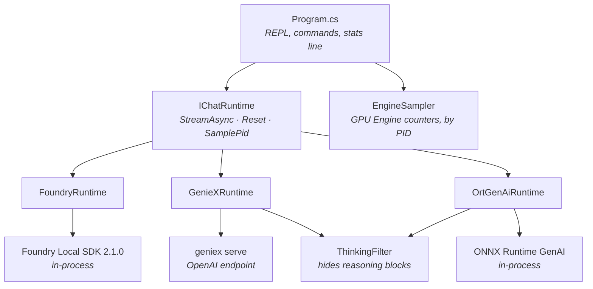

# atlas-chat

A chat console that drives **three different local inference runtimes** through
one interface, so they can be compared by using them rather than by reading a
benchmark table.

```
> What is 17 times 23?
17 × 23 = (10 × 17) + (3 × 17) = 170 + 51 = 391
  16.6 tok/s · 261 tok · first 0.54s · compute 100%
```

---

## Why this exists

[Atlas](../../../README.md) measures local inference on a Snapdragon X2 Elite,
and the benchmarks answer *how fast*. They do not answer the questions that
decide an integration:

- What does the latency actually feel like at the keyboard?
- Does the model hold a conversation, or lose the thread after one turn?
- What breaks when you wire it up — and does it break **loudly**?

Those only surface by using the thing. This console runs the same REPL against
each runtime so the differences are experienced directly, and every
integration trap found along the way is recorded here rather than rediscovered.

The benchmark harnesses in [`Scripts/`](../../../Scripts) and
[`src/setup/`](../../setup) remain the place for numbers. This is the place for
behaviour.

---

## Quick start

```powershell
# Foundry Local — in-process, nothing to start first
dotnet run -c Release --project src\csharp\AtlasChat

# GenieX — needs a server running in another terminal
geniex serve
dotnet run -c Release --project src\csharp\AtlasChat -- --runtime geniex

# ONNX Runtime GenAI — takes a model DIRECTORY, and reasons a lot
dotnet run -c Release --project src\csharp\AtlasChat -- --runtime ort-genai --max-tokens 1500
```

| Option | Default | |
| --- | --- | --- |
| `--runtime` | `foundry` | `foundry`, `geniex`, `ort-genai` |
| `--max-tokens` | 512 | Output cap, enforced by the harness |
| `--temperature` | 0.7 | |
| `--top-k` | 40 | Lower reduces repetition on small models |
| `--host` | `127.0.0.1:18181` | GenieX server address |
| `--show-think` | off | Reveal a reasoning model's `<think>` block |
| `--quiet` | off | Hide the stats line |

Commands: `/reset` `/stats` `/model` `/help` `/quit`

---

## Architecture



Adding a backend means implementing `IChatRuntime`. The REPL has not changed
once across three of them, which is the only real test of the abstraction.

### The interface is deliberately small

`StreamAsync(userMessage)` · `Reset()` · plus a few properties the stats line
needs. Three of those properties exist because of something measured, not
because of symmetry:

| Member | Why it exists |
| --- | --- |
| `SamplePid` | Utilization counters are per-process. GenieX generates in the *server*, so the harness must be told which process to watch. |
| `LastFirstTokenSeconds` | A backend may suppress leading output. The first token the *caller* sees can be far later than the first the model produced. |
| `LastFinishReason` | Distinguishes a finished answer from one the cap truncated. |

### Conversation history belongs to the backend

Not to the harness. The three mechanisms do not compose:

- **Foundry** — `ChatSession` keeps turns internally and offers `UndoTurns`.
- **GenieX** — the endpoint is stateless and wants the whole message array on
  every request.
- **ORT GenAI** — wants an accumulated token sequence, re-templated each turn.

Passing a shared history down would be double-counted by the first. So the
interface takes a single message and each backend does what it does natively.
`Reset()` means "forget", not "clear this list".

### Utilization sampling

Windows exposes the NPU and GPU through the ordinary `GPU Engine` counter set.
Instances are named `pid_<pid>_luid_<luid>_..._engtype_<type>`, which lets the
sampler attribute work **to a specific process** — something the
out-of-process PowerShell samplers in `Scripts/` cannot do, since they watch a
child process and take a global maximum.

### Hiding reasoning

Qwen3 and the reasoning Phi builds emit `<think>` blocks inline. The GenieX
*CLI* has `--think=false`; neither its HTTP endpoint nor ORT GenAI does, so
`ThinkingFilter` does it. Hidden tokens still count toward the rate — producing
them is real work — and hidden text never goes back into the conversation.

---

## What the stats line means

```
  16.6 tok/s · 261 tok · first 0.54s · ended: length · compute 100%
```

- **tok/s** — decode phase only, dividing by tokens *after* the first, since
  the first is where the window starts. Short turns are noisy by nature.
- **`~`** on the token count means it is estimated from streamed pieces.
- **`ended:`** appears only when the turn did not stop naturally. `length`
  means the cap truncated it.
- **engine types, not "NPU"** — see below.

---

## What building this turned up

Most of these are things that fail *quietly*, which is why they are worth
writing down.

**A compute engine is not necessarily the NPU.** The plan was to print "NPU %".
Enumerating the counters showed
`pid_3648_luid_..._0x000148C0_..._engtype_Compute` — and `0x000148C0` is the
**Adreno**. GPUs expose compute engines too, so `engtype_compute` alone does
not identify the Hexagon. The stats line reports engine types instead, which is
honest and more useful: you watch work move between `compute` and `3d` as you
change backends.

**`engtype_Compute` has a capital C.** PowerShell counter paths are
case-insensitive, so the wildcard form works there. .NET string matching is
not, and a lower-case filter matches nothing — silently.

**Neither backend's own token metrics were usable.** Foundry's
`GetUsage().CompletionTokens` reported 48 tokens for *"Your name is Mike."* and
34 for a much longer reply — neither per-turn nor cumulative in any usable way.
GenieX's endpoint returns `usage` **and** a llama.cpp-style `timings` block with
every field zero. Both are counted client-side instead.

**Marker detection that works on one backend fails on another.** GenieX's SSE
stream delivers `<think>` as one chunk, so a substring test per piece works.
ORT GenAI decodes token by token and splits it, so the same test matched
nothing and the entire chain of thought landed in the transcript. The filter
now buffers and holds back only as much tail as a marker could span.

**Feeding a model its own reasoning degrades it.** Storing the `<think>` block
as assistant history and sending it back made the model stop recalling a name
given one turn earlier — *"How can I assist you?"* instead of *"Mike"*. Storing
only the visible reply fixed it.

**Three ways to report a rate, two of them wrong.** Dividing total tokens by
the decode window gave **1278 tok/s** for a five-word reply, because the window
starts at the first token. Dividing *all* tokens — including hidden reasoning —
by the window starting at the first *visible* token gave **718 tok/s**. Both
look plausible in isolation.

**A null `ILogger` hides the error it was meant to report.** Foundry's
`CreateAsync` logs failures through the logger it is handed, so passing null
turns any startup problem into an `ArgumentNullException` raised from inside
the exception constructor.

**Each backend identifies models differently** — an alias (`qwen2.5-0.5b`), a
fully-qualified server id (`unsloth/Qwen3-0.6B-GGUF:Q4_0`), or a filesystem
directory. There is no common naming, so each backend validates its own and
lists what is available when the name is wrong.

---

## Backends

| `--runtime` | Transport | Model identifier | Measured here |
| --- | --- | --- | --- |
| `foundry` | In-process SDK 2.1.0 | catalogue alias | 33–82 tok/s |
| `geniex` | HTTP, `geniex serve` | `org/repo:QUANT` | ~126 tok/s |
| `ort-genai` | In-process + QNN EP | model directory | ~17 tok/s |

> **Those three figures are not comparable** — each ran a different model.
> For the one comparison that is fair, see below.

### The same model through two runtimes

`Phi-4-mini-reasoning` is published as a GGUF and as an ONNX bundle, so GenieX
and ORT GenAI can run it side by side. Same prompt, same 1500-token cap:

| Runtime | Asset | Decode | First token |
| --- | --- | --- | --- |
| `geniex` | `Q4_0` GGUF | **31.7 · 30.6 tok/s** | 0.11 s warm |
| `ort-genai` | `qnn-int4` ONNX | 15.2 · 16.1 tok/s | 0.14 s |

**GenieX is about 2× faster**, both at 100 % on the compute engine, and both
answered correctly. The quantizations differ, so some of the gap is weights
rather than runtime — that confounder cannot be removed with what is published.

The first GenieX turn after a cold start reported 7.01 s to first token: that
is the server loading the model, not prefill. The next turn was 0.11 s.

### foundry

Simplest: in-process, nothing to start. Constrained by its catalogue — only two
models target the NPU on this machine, and the larger one does not load through
the SDK, so this path is effectively capped at a **0.5B** model.

`SearchOptions.FrequencyPenalty` and `PresencePenalty` are exposed but **inert**
— any non-zero value fails the request. `--top-k` substitutes.

### geniex

Fastest, and takes any GGUF the server has cached. The server must already be
running; the console will not start one and says so with the fix. Utilization
is sampled from the **server's** PID, printed at startup.

### ort-genai

Takes a model **directory** containing `genai_config.json` — a GenieX bundle
has `genie_config.json`, a different format, and the console says so.

`max_length` is never set: this model class sizes its KV cache from
`genai_config.json` through `past_present_share_buffer`, and overriding it
breaks that allocation. `--max-tokens` is enforced by counting instead.

Budget generously. `Phi-4-mini-reasoning` spent **261 tokens** answering
"what is 17 times 23?" and **1500** reasoning about "my name is Mike". It is
the only ORT GenAI NPU model available, so this backend is awkward for
conversational use through no fault of the harness.

---

## Where this differs from the vendor sample

Foundry Local's own sample uses the non-streaming shape:

```csharp
using var response = await session.ProcessRequestAsync(request);
var text = string.Join(Environment.NewLine,
    response.OfType<MessageItem>()
            .Where(m => m.IsSimpleText())
            .Select(m => m.GetSimpleText()));
```

Two things from it were worth taking, and one was not.

**Adopted: dispose the response.** `StreamingResponse` and the `Response` it
yields both wrap native handles, and neither was being disposed. Measured over
12 turns, handle count rose from 1449 to 1462 and then **plateaued**, so the
finalizers were already reclaiming them and explicit disposal did not move the
number. It is correctness rather than a leak fix: native resources now go back
deterministically instead of whenever the GC decides.

**Adopted: guard with `IsSimpleText()`** before calling `GetSimpleText()`. A
multi-part message is not simple text, and asking for it anyway is undefined.

**Not adopted: `ProcessRequestAsync`.** The non-streaming call returns one
finished response, which is simpler but wrong for a chat console. It cannot
show tokens as they arrive, and it makes time to first token unmeasurable —
the metric that separates these runtimes most visibly.

`ConfigureAwait(false)` also appears in the sample. It is correct library
hygiene, but a console application has no synchronization context, so here it
would be a no-op on every await. Worth adding if this code is ever lifted into
a library.

## Why a small model repeats itself

A 0.5B model answering an open-ended question will repeat one sentence until
something stops it. Three things are in play and only the first is the
harness's:

- **No cap means no stop.** Generation ran to the 32k context window.
  `--max-tokens` bounds it and `ended: length` makes a runaway visible.
- **Sampling helps a little.** `DoSample` is on with `--temperature` and
  `--top-k`. Verified working: the same prompt at 0.1 and 1.5 gives different
  answers, and two runs at 1.5 differ from each other.
- **The model is the real limit.** `qwen2.5-0.5b` still loops on open-ended
  prompts at every setting tried; it is fine on factual ones. `phi-3.5-mini` at
  2.0 GB handled the same class of prompt coherently for 357 tokens.

---

## Build notes

- `<RuntimeIdentifier>win-arm64</RuntimeIdentifier>` is required — the Foundry
  package is RID-specific and the build fails without it. That also changes
  where native libraries land: **beside the exe**, not under
  `runtimes/win-arm64/native`. The ORT GenAI backend checks both.
- The target framework is `net10.0-windows` rather than suppressing CA1416.
  Foundry Local and the `GPU Engine` counters are both Windows-only.
- `TextItem.Text` is the payload. `ToString()` returns the type name, so a
  reply streams as `Microsoft.AI.Foundry.Local.TextItem` repeated — it looks
  like garbled output rather than an error.

## Not done yet

- No tool calling, which Scout will need. `ChatSession` has
  `AddToolDefinition`; the GenieX endpoint takes an OpenAI `tools` array.
- Nothing is written to the [benchmark history](../../../docs/BENCHMARKS.md#benchmark-history).
  This is an interactive tool, and its turn-by-turn numbers are too noisy to be
  worth recording.
