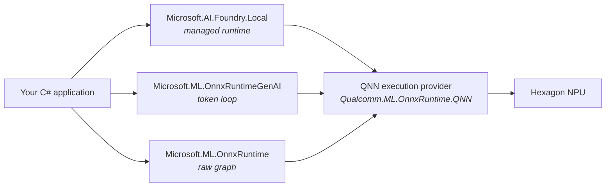

# C# on the Hexagon NPU

The .NET side of [Atlas](../../README.md). Four projects that answer one
question — **can a C# application reach the Snapdragon NPU, and how?** — and
one that uses the answer.

Everything here runs natively on Windows ARM64 and was measured on a Snapdragon
X2 Elite (X2E78100).

---

## The projects

| Project | What it is | Result |
| --- | --- | --- |
| [**AtlasChat**](AtlasChat) | Chat console driving three runtimes behind one interface | The usable thing |
| [QnnProbe](QnnProbe) | Proves which attachment API puts an ONNX graph on the NPU | `QNNExecutionProvider=1` via the policy API |
| [GenAiProbe](GenAiProbe) | Runs a language model through ONNX Runtime GenAI | 17.7–22 tok/s, NPU peak **98.9 %** |
| [FoundryProbe](FoundryProbe) | Benchmarks Foundry Local's in-process SDK | **109.3 tok/s** |

The three probes are deliberately single-purpose: each establishes one fact and
prints the evidence for it. [AtlasChat](AtlasChat) builds on all three.

```powershell
dotnet run -c Release --project src\csharp\QnnProbe
dotnet run -c Release --project src\csharp\GenAiProbe
dotnet run -c Release --project src\csharp\FoundryProbe
dotnet run -c Release --project src\csharp\AtlasChat
```

---

## The three routes to the NPU



All three reach the same hardware through the same execution provider. They
differ in how much they do for you:

| | Does for you | You supply | Measured |
| --- | --- | --- | --- |
| **Foundry Local** | Model catalogue, download, provider selection | A model alias | 109.3 tok/s |
| **ORT GenAI** | KV cache, sampling, chat templating | A model directory, provider attachment | 17.7–22 tok/s |
| **ORT direct** | Graph execution | Everything above it | — |

**Use ORT directly for models that are not language models** — embeddings,
Whisper, OCR, translation. One forward pass, no token loop, so the GenAI layer
adds nothing. Reach for ORT GenAI when you need the token loop itself, and
Foundry Local when you want none of this to be your problem.

---

## The one thing to get right

**Attach the provider with the policy API, not a provider list or an options
dictionary.** Both of the obvious approaches fail, and only one of them fails
loudly.

```csharp
// Register the plugin, then select it by POLICY.
OrtEnv.Instance().RegisterExecutionProviderLibrary(
    "QNNExecutionProvider", Path.Combine(nativeDir, "onnxruntime_providers_qnn.dll"));

var so = new SessionOptions();
so.SetEpSelectionPolicy(ExecutionProviderDevicePolicy.PREFER_NPU);
so.AddSessionConfigEntry("session.disable_cpu_ep_fallback", "1");   // silent fallback -> hard error
```

Measured by [QnnProbe](QnnProbe), counting node placement from the ORT profiler
rather than trusting a successful `Run()`:

| Attachment | Result |
| --- | --- |
| none (baseline) | `CPUExecutionProvider=1` |
| `AppendExecutionProvider("QNN", opts)` | **throws** — *"QNN execution provider is not supported in this build"* |
| `SetEpSelectionPolicy(PREFER_NPU)` | **`QNNExecutionProvider=1`** |

For ORT GenAI the equivalent is `Config.ClearProviders()` then
`Config.AppendProvider("QNNExecutionProvider")`. Registering the library alone
is not enough: GenAI builds a CPU-only session and the EPContext nodes have
nothing to run on.

> **`OrtEnv.GetAvailableProviders()` never lists QNN in C#**, before or after
> registration, even while a graph demonstrably runs on the NPU at 98.9 %.
> Python does list it. Do not use it as an availability check — verify with node
> placement, or by setting `session.disable_cpu_ep_fallback` and seeing whether
> the session still loads.

---

## Package pairings that work

Versions matter more than usual here, and the obvious choices are often wrong.

| Purpose | Package | Version |
| --- | --- | --- |
| ONNX Runtime | `Microsoft.ML.OnnxRuntime` | 1.30.0 |
| QNN execution provider | `Qualcomm.ML.OnnxRuntime.QNN` | 2.6.0 |
| Generation loop | `Microsoft.ML.OnnxRuntimeGenAI` | 0.17.1 |
| Foundry Local | `Microsoft.AI.Foundry.Local` | 2.1.0 |

Three packages to avoid, all of which look like the right choice:

- **`Microsoft.ML.OnnxRuntime.QNN`** (1.24.x) compiles QNN into the build
  instead of supplying it as a plugin. It pairs with the options-dictionary
  attachment that most examples show. Do not mix that advice with the plugin
  packages above.
- **`Microsoft.ML.OnnxRuntimeGenAI.QNN`** is pinned at **0.13.2**, far behind
  0.17.1. Outside the broken 0.16.x range so it may work, but untested here and
  it mixes the two packaging models.
- **`Microsoft.AI.Foundry.Local.WinML`** was retired in Foundry SDK **2.0.1**
  and is frozen at 1.2.4. That release replaced the in-process OpenAI-style
  clients with the Session API and dropped the `-winml` variants. The old one
  carries ONNX Runtime GenAI 0.14.1 against 2.1.0's 0.17.1, and behaved
  erratically in testing — 103 tok/s on the first run then 9–15, with a
  segfault on exit.

---

## Project setup that bites

- **`<RuntimeIdentifier>win-arm64</RuntimeIdentifier>` is required** by anything
  referencing the Foundry package; it is RID-specific and the build fails with
  `NETSDK1047` without it.
- **That changes where native libraries land.** A RID-specific build puts
  `onnxruntime_providers_qnn.dll` **beside the exe**; a portable one puts it
  under `runtimes/win-arm64/native`. Code that assumes one silently fails to
  register under the other. Check both.
- **The HTP stub is per generation** — `QnnHtpV81Stub.dll` for X2 Elite,
  `V73` for X Elite. The Qualcomm package ships both, so point the loader at
  the directory rather than copying one by hand.
- **`FoundryLocalManager.CreateAsync` needs a real `ILogger`.** It logs failures
  through the logger it is handed, so a null turns any startup problem into an
  `ArgumentNullException` raised from inside the exception constructor.
- **Target `net10.0-windows`** if you touch performance counters, rather than
  suppressing CA1416. These paths are Windows-only in fact, not just in
  practice.

---

## Where the numbers live

Full results and methodology are in
[docs/BENCHMARKS.md](../../docs/BENCHMARKS.md). Resolved investigations — the
`onnxruntime-genai` 0.16 regression, the Adreno driver that broke GGUF
inference — are in [docs/ARCHIVE.md](../../docs/ARCHIVE.md).

The equivalent Python work is in [`src/setup/`](../setup), and the two agree:
the C# and Python APIs mirror each other closely enough that the same traps
appear in both, usually with the same fix.
